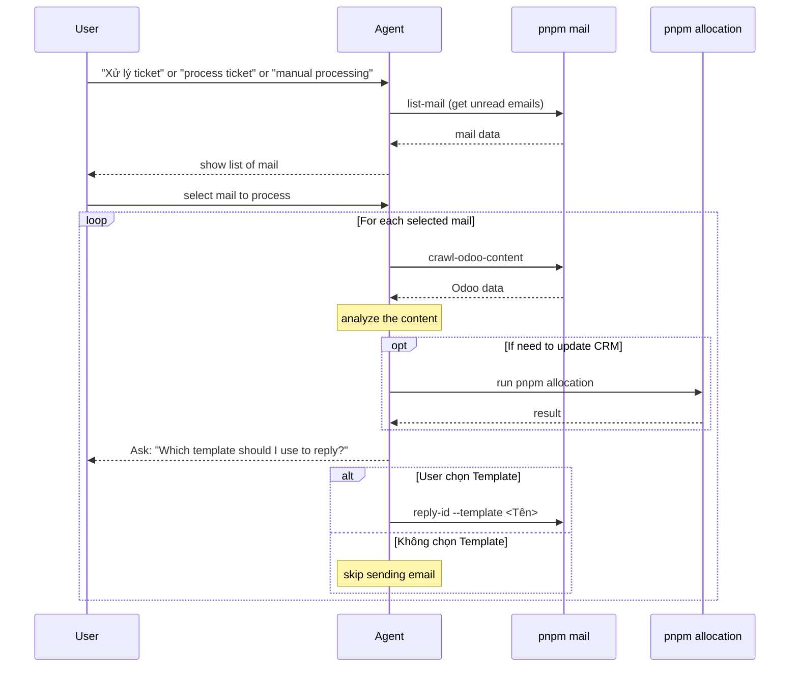

# Workflow: Interactive Ticket Processing

**Trigger:** When the user says "Xử lý ticket" or "process ticket" or "manual processing".

## Flow Description

Do NOT stop mid-task abruptly, but interact with the user dynamically during execution. The process is as follows:

1. **List Mails:** Run `pnpm mail list-mail` to get emails. Present them to the user as a formatted table.
2. **User Selection:** Ask the user to select which one email to process. Wait for their choice.
3. **Processing Loop:** For the selected email:
   - Run `pnpm mail crawl-odoo-content -n <position>` to gather context.
   - If output is "No link found in this email." -> skip, move to next.
   - Analyze the Odoo content and determine the issue.
   - If CRM updates are needed, run `pnpm allocation --lead-id <leadId>`. Wait for success.
   - **Ask for Template:** Present the analysis to the user and ask: "Which template should I use to reply?".
   - If a template is user-selected, run `pnpm mail reply-id --id <messageId> --template <templateFile>`.
   - If the user doesn't choose a template (or skips), skip sending the email.
4. **Completion:** Summarize the processed results.

> ⚠️ CRITICAL: Do NOT execute any action (reply, allocation, etc.) without explicit user approval or selection for EACH email.

## Sequence Diagram

